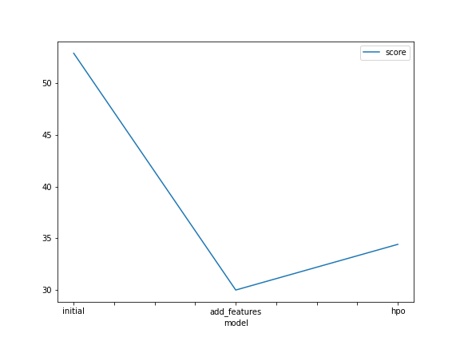
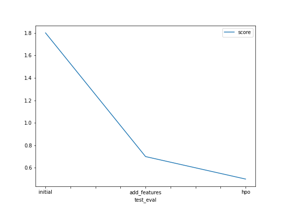

# Report: Predict Bike Sharing Demand with AutoGluon Solution
#### NAME HERE

## Initial Training
### What did you realize when you tried to submit your predictions? What changes were needed to the output of the predictor to submit your results?
Without performing any feature engineering or fine tuning of the model, Kaggle scores were rather poor. There was no need to replace negative values with 0 but a line with these statements was left in the notebook in case new runs have impact on the values as this is a stochastic process. 

### What was the top ranked model that performed?
WeightedEnsemble_L3 for both the initial training and EDA analysis parts. WeightedEnsemble_L2 for the hyperparameter part. 

## Exploratory data analysis and feature creation
### What did the exploratory analysis find and how did you add additional features?
We split the datetime feature into day, month and hour. Additionally we also converted 'season' and 'weather' to categorical features.

### How much better did your model preform after adding additional features and why do you think that is?
Adding more granularity to datetime features usually helps the model understand the underlying details of the data. The same happened when we converted 'season' and 'weather' features to categorical as the model was able to see the relation across the different values instead of seeing just a number. 

## Hyper parameter tuning
### How much better did your model preform after trying different hyper parameters?
In terms of training scores, it actually performed worse than the model with new features. However, for the submission sample Kaggle provided, the model ended up doing better as we were able to achieve an improved score (from 0.7 to 0.5).

### If you were given more time with this dataset, where do you think you would spend more time?
Working on feature engineering, as most of the times poor model performance lies on data quality rather than tuning hyperparameters. 

### Create a table with the models you ran, the hyperparameters modified, and the kaggle score.
|model|hpo1|hpo2|hpo3|score|
|--|--|--|--|--|
|initial|default_values|default_values|default_values|1.8|
|add_features|default_values|default_values|default_values|0.7|
|hpo|GBM: num_leaves: lower=26, upper=66|NN: droupout_prob: (0.0) -> (0.5)|GBM: num_boost_round: 100|0.5|

### Create a line plot showing the top model score for the three (or more) training runs during the project.

### Create a line plot showing the top kaggle score for the three (or more) prediction submissions during the project.

## Summary
This project allowed me to apply the learned concepts in the first part of the course to a real life and close-to-my-day-to-day-basis problem! 